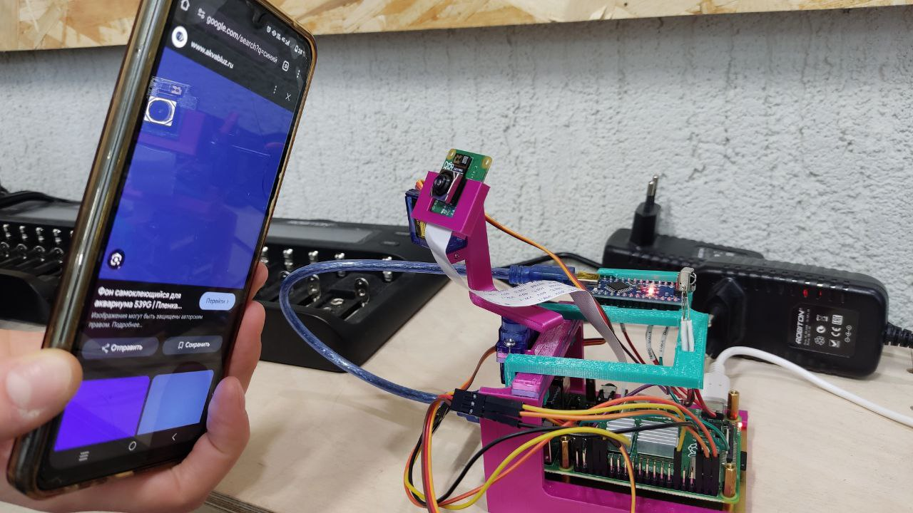

# Camera project

Идея проекта заключалась в том, чтобы создать камеру, реагирующую на движение. В итоговом варианте камера реагирует на синий цвет, а так же может двигаться с помощью пульта. Мозгом нашего проекта стала [Raspberry pi 4](https://www.raspberrypi.com/documentation/computers/raspberry-pi.html) с камерой [Camera Module 3.](https://www.raspberrypi.com/products/camera-module-3/)  Чтобы камера была подвижной по осям Ox и Oy, мы использовали два [сервопривода](https://docs.sunfounder.com/projects/ultimate-sensor-kit/en/latest/components_basic/27-component_servo.html). Для включения/выключения камеры и её управления был задействован [ИК-приемник,](https://roboshop.spb.ru/sensors/infrakrasnye-datchiki/tl1838) управляемый [Arduino Nano](https://3d-diy.ru/blog/arduino-nano/?srsltid=AfmBOoobsfLvRHXmztk4oDekqijM6OquVmeA1C7HS3Jm3zs6FXj-3EUY).



# Настройка Raspberry pi

## Установка OS и VNC

Накатили Raspberry pi OS (все необходимое можно найти
[здесь](https://www.raspberrypi.com/software/)).
Советую сразу настроить удаленный доступ к графическому интерфейсу
[VNC для удобной работы с малинкой.](https://habr.com/ru/sandbox/148360/)

## Настройка виртуального окружения для работы с python

Для нормальной работы с библиотекой picamra2, лучше установить виртуальное окружение:

```sh
sudo apt install python3-venv
python3 -m venv —system-site-packages env
```

Для активации:

```sh
source env/bin/activate
```

Соответственно, чтобы выйти из окружения: `deactivate`
Для работы с пинами малинки использовали библиотеку [pigpio,](https://abyz.me.uk/rpi/pigpio/pigpiod.html) для работы с которой нужно запустить pigpio library as a daemon:

```sh
sudo pigpiod
```

## Настройка ИК-приемника

## ИК-приемник на Raspberry pi (LIRC)

Вообще говоря, сначала мы пытались обрабатывать кнопки все так же на малике через библиотеку LIRC. Нужно было немного изменить конфиг малинки, добавив несколько строчек в него ([вот здесь все детально расписано](https://www.instructables.com/Setup-IR-Remote-Control-Using-LIRC-for-the-Raspber/)). Схему подключения ИК-приемника к малинке не буду вставлять - тут все просто: gnd  к gnd; vcc к 3.3v; out к, например, 18 порту малинки (GPIO18 имеет альтернативную функцию **PCM\_CLK**, которая позволяет использовать аппаратный PWM, что критично для стабильного декодирования ИК-сигналов)
Проверяем, что ИК-приемник работает:

```sh
mode2 -d /dev/lirc0
```

Если на экран выводится **pulse/space codes**, то все круто - работает.
Второй шаг - найти конфиг для нашего пульта.У нас это обычный китайский пульт Car mp3.

Но внимание!!! На него[в общем архиве](https://lirc.sourceforge.net/remotes/) не нашлось конфига!!! Окей - мы не отчаялись. В таком случае можно вручную записать свой, используя утилиту irrecord. Однако, как и  было написано в указанной ранее[статье :](https://www.instructables.com/Easy-Setup-IR-Remote-Control-Using-LIRC-for-the-Ra/) "I was VERY unsuccessful trying to create a file using this utility despite much effort". Испытав такое же разочарование на своем опыте, мы пошли вглубь интернета с целью все-таки найти конфиг под наш пульт. И знаете что, кто ищет - тот найдет! Ура конфиг найден! Если кому понадобится ссылка есть на [этом сайте](https://elchupanibrei.livejournal.com/43594.html) рядом с каринкой пульта. Добавляем сюда `/etc/lirc/lircd.conf.d/` наш конфиг и инклюдим его в  `/etc/lirc/lircd.conf:`

```sh
mv carMP3.conf /etc/lirc/lircd.conf.d/
sudo echo 'include "lircd.conf.d/*.conf"' >> /etc/lirc/lircd.conf 
```

Перезапускаем LIRC и проверяем работает ли конфиг для пульта:

```sh
sudo service lirc start
irw /var/run/lirc/lircd
```

После нажатия пульта должно выводиться что-то типа:

```sh
0000000000ffb04f 00 KEY_200+ carMP3.conf
```

Проделываем те же махинации,  что и в статье, за исключением содержания  irexec.lircrc - его делаем своим. Итак, после перезапуска малинки мы должны были смочь по нажатию кнопки пульта выполнить указанные в irexec.lircrc команды. Но ничего опять не получилось(((  Я даже проверяла логи:

```sh
sudo journalctl -u lircd -n 50 --no-pager
```

Но ошибки вроде и не было, но и ничего не работало, как надо. Так что было принято стратегическое решение воспользоваться arduino для работы с пультом - так оказалось в разы проще.

## ИК-приемник и arduino nano

Итак перед нами цель - сделать так, чтобы ардуинка принимала сигналы с ИК-приемника и отправляла название кнопки через Serial порт на малинку.
Скетч под это дело уже есть на просторах интернета: [https://newbiely.com/tutorials/arduino-nano/arduino-nano-ir-remote-control](https://newbiely.com/tutorials/arduino-nano/arduino-nano-ir-remote-control). Я его впоследствии немного изменила под свои нужды, но об этом позже. Короче говоря, заливаем скетч на ардуинку. Проверим через Serial Monitor, что кнопки на пульте правильно отображаются. Теперь подключаем это все к Raspberry pi (не забываем тут про usb кабель):


## Написание кода

### Код для камеры и сервоприводов

В изначальном варианте мы хотели использовать yolo как модель компьютерного зрения для обнаружения объектов (в частности людей). Однако, малинка работала исключительно медленно, поэтому мы отказались от этой идеи. Вместо этого наша камера детектит объекты синего цвета и соответственно движется в сторону него. Для анализа изображений используем библиотеку OpenCV. Код с yolo и наш лежит в исходниках.

### Как arduino взаимодействует с Raspberry pi

Внутри основной программы создаются две нити исполнения. Одна отвечает за обработку изображений, поиск координат центра замеченного объекта и движение сервоприводов. Другая - за ожидания сигнала с Serial порта, который посылает arduino, если нажать кнопку пульта. Взаимодействие происходит через очередь сообщений. Код смотри в src/arduino.py.

## Включение камеры по пульту

Теперь нам нужно с помощью кнопки на пульте включать камеру (запускать наш питоновский код).  Мы можем подавать на некоторый пин ардуинки высокий сигнал при пуске (здесь как раз и придется изменить предыдущий скетч). Этот сигнал должна поймать малинка и запустить основную программу. Проблема заключается в том, что

1) нужен еще один скрипт, который стартует сразу после включения малинки и ждет сигнала с GPIO;
2) при запуске малинки нужно еще активировать демона для работы с pigpio библиотекой.

Это все довольно легко решается с помощью [Cron](https://timeweb.com/ru/community/articles/chto-takoe-cron).

```sh
sudo crontab -e
```

Добавляем следующую строчку в конец и перезапускаемся:

```sh
@reboot /home/pi/env/bin/python3 /home/pi/listener.py > log_listener.txt 2>&1
```

где listener.py - скрипт, ожидающий сигнала. Теперь при включении малинки, запускается listener.py на заднем фоне.  Это можно проверить:

```sh
ps aux | grep python
```

При получении сигнала listener.py запускает еще один скрипт - awake.sh, который лишь запускает демона pigpio и основную прогу.
